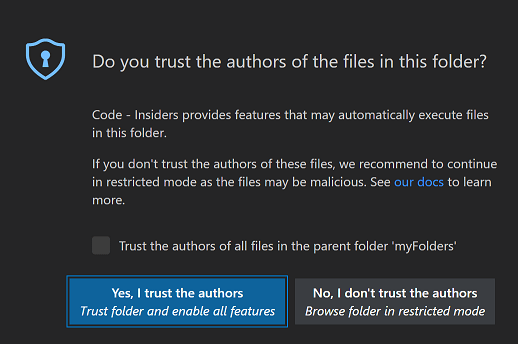
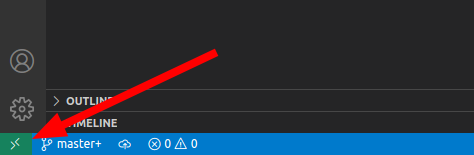
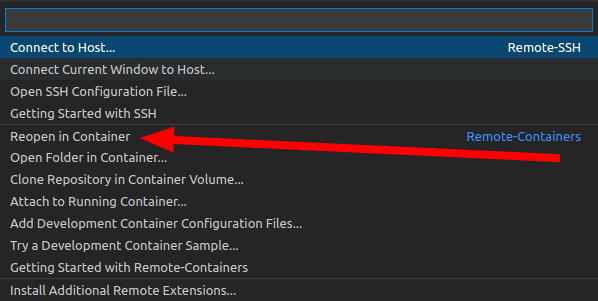

# UGain - containers and Kubernetes Smoke Test

This repository contains the necessary files to run the lab session about (Docker) containers and Kubernetes.

## Initial setup

* [How to install the required software on Windows.](setup-windows.md)

## Getting started

Warning: opening the workspace devcontainer will create a new kind kubernetes cluster on your host system. If you already have a kind cluster with the name `ugain` that should not be deleted do not open this workspace!**

1. Clone this repository to your computer using git.
1. Open `lab-containers-smoketest.code-workspace` using Visual Studio Code.
1. Choose "Yes, I trust the authors", so VSCode enables regular mode.

   

1. Click on the "Remote" icon on the bottom left of VSCode.

   

   1. Choose the option "Reopen in container" from the command palette.

      

   1. The container will be automatically created based on the configuration included in the lab files.
1. Wait until the containers are set up. This can take a few minutes because the container needs to be pulled and built. You can check the progress by clicking "Starting Dev Container (show log)" in the notification on the bottom right of VSCode.
1. When the containers are setup, **Click on Terminal -> Run Task -> start smoke test**. A terminal will appear with the smoketest running. The output should look somewhat like the following:

```bash
 *  Executing task: ./smoketest.sh 

Checking if docker compose is installed..
✅ installed
Checking is docker containers are running..
✅ kind control plane is running
✅ kind worker is running
✅ kind registry is running
Downloading docker images..
cuda-10.0: Pulling from anibali/pytorch
Digest: sha256:e380de2da62ad6696d46b924f6e68dd901167bb5a8f7b8e8b2a3d92ef614e8b9
Status: Image is up to date for anibali/pytorch:cuda-10.0
docker.io/anibali/pytorch:cuda-10.0
✅ image pulled
Checking is k8s cluster is running..
NAME                 STATUS   ROLES           AGE   VERSION
kind-control-plane   Ready    control-plane   13m   v1.31.2
kind-worker          Ready    <none>          13m   v1.31.2
✅ K8S api server is reachable
Smoke test is done!
 *  Terminal will be reused by tasks, press any key to close it. 
```

## Copyright

You can use and modify this lab as part of your education, but you are not allowed to share this lab, your modifications, and your solutions. Please contact the teaching staff if you want to use (part of) this lab for teaching other courses.

Copyright © teaching staff of the course "Machine Learning into Practice: Deep Dive into MLOps" at the Faculty of Engineering and Architecture - Ghent University.
