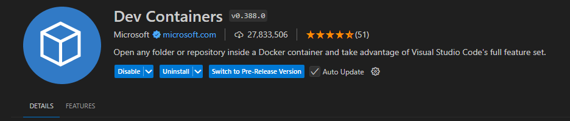

## Install Docker desktop

To execute Docker containers, build images or just interact with running containers, a service is required. This is the Docker Daemon. You will first have to install the docker daemon on your pc/laptop to start working. To do this please download and install the latest version of [Docker Desktop](https://www.docker.com/get-started/).

You should be able to use the `docker` command without having to use `sudo`.

1. **Now REBOOT your computer!**

## [after reboot] Install Visual Studio Code

1. Install [Visual Studio Code (VSCode)](https://code.visualstudio.com).
1. Install the "Dev Containers" extension in Visual Studio Code.
   
   

## Run the smoke-test to check if everything is working correctly

Follow the instructions in the [README.md](https://github.com/idlab-discover/ugain-mlops-k8s-smoketest/blob/main/README.md) to run the smoketest and see if everything was installed correctly.
