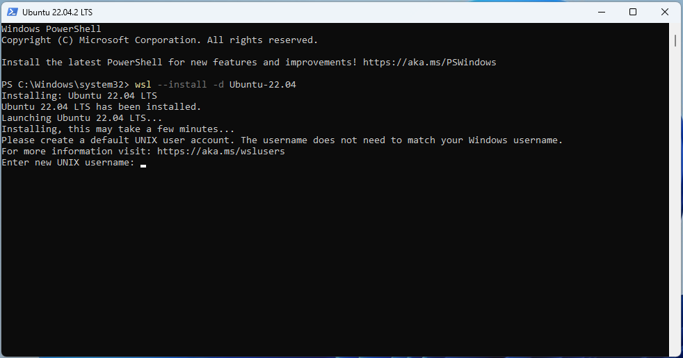
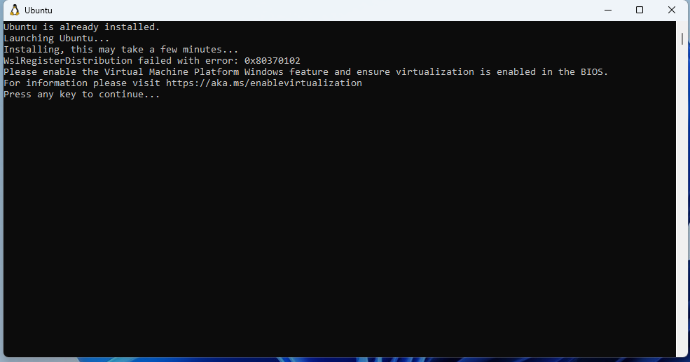
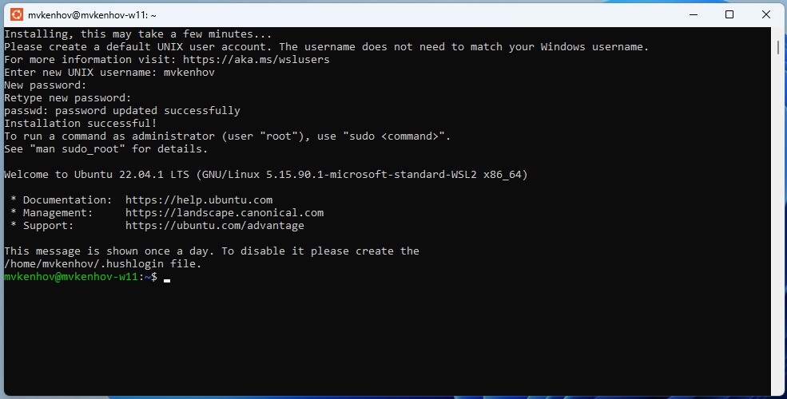
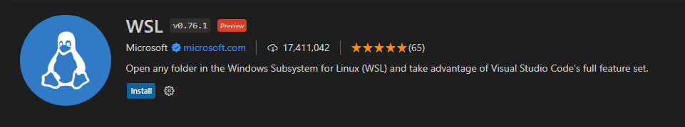
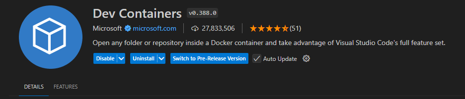

We're using the [Windows Subsystem For Linux](https://en.wikipedia.org/wiki/Windows_Subsystem_for_Linux) (WSL) to run Ubuntu on Windows 10/11. WSL is a compatibility layer for running Linux programs on Windows 10/11. All the development will happen in Ubuntu running inside of this compatibility layer. Visual Studio Code will be installed on Windows itself and connect to Ubuntu to compile and run your code.

## Install WSL and Ubuntu

<!--https://learn.microsoft.com/en-us/windows/wsl/install-->

> :warning: Make sure virtualization is turned on in your BIOS/UEFI: [Microsoft docs on enabling virtualization](https://support.microsoft.com/en-us/windows/enable-virtualization-on-windows-11-pcs-c5578302-6e43-4b4b-a449-8ced115f58e1)

1. Open PowerShell as Administrator (Start menu > PowerShell > right-click > Run as administrator).

1. Run the following command in PowerShell to update WSL to the latest version.

   ```powershell
   wsl --update
   ```

1. Restart your computer!

1. Run the following command in PowerShell to install Ubuntu-24.04 in WSL. After the installation you should see the screen below. If not, restart your computer and go to the Start menu and start `Ubuntu`.

   ```powershell
   wsl --install -d Ubuntu-24.04
   ```

   

   - If you see an error regarding virtualization not being enabled. Go back to the top of this page and make sure to read the part "Make sure virtualization is turned on in your BIOS/UEFI".
  
      

1. Choose a username and password (password characters are hidden, it looks like the password input stays blank).

   

## Install development tools in Ubuntu WSL

Open a Ubuntu CLI and follow these instructions (go to Start menu > Ubuntu).

1. First, make sure all existing software is up to date.

   ```bash
   sudo apt update && sudo apt upgrade -y
   ```

   > :warning: If you have network issues in WSL at this point, this might be due to your anti-virus. The firewall in Kaspersky, AVG and Avast sometimes block WSL from accessing the internet. We recommend to either configure the anti-virus to allow WSL network access or use Windows Defender instead.
   >
   > If you still have network issues, try running the following commands, one-by-one, and **restart your computer** afterwards:
   >
   > ```shell
   > sudo rm /etc/resolv.conf
   > sudo bash -c 'echo "nameserver 1.1.1.1" > /etc/resolv.conf'
   > sudo bash -c 'echo "nameserver 8.8.8.8" >> /etc/resolv.conf'
   > sudo bash -c 'echo "nameserver 8.8.4.4" >> /etc/resolv.conf'
   > sudo bash -c 'echo "[network]" > /etc/wsl.conf'
   > sudo bash -c 'echo "generateResolvConf = false" >> /etc/wsl.conf'
   > sudo chattr +i /etc/resolv.conf
   > ```
   >

1. Install the tools and docker runtime inside of WSL.

   ```bash
   sudo apt install git docker.io docker-compose docker-buildx -y
   ```

1. Create the `docker` group (it is possible that the group already exists) and add your user to that group.

   ```bash
   sudo groupadd docker
   sudo usermod -aG docker $USER
   ```

1. Configure git with your username and email.

   ```bash
   # Run this with the correct email and name
   git config --global user.email "you@example.com"
   git config --global user.name "Your Name"
   ```

1. **Now REBOOT your computer!**

## [after reboot] Install Visual Studio Code

1. Install [Visual Studio Code (VSCode)](https://code.visualstudio.com) **on Windows**.
1. Start VSCode and install the "WSL" extension in Visual Studio Code.
   
   

1. Install the "Dev Containers" extension in Visual Studio Code.
   
   

> :warning: Close all the running Ubuntu CLI's after the VSCode installation has finished. This is needed to apply the VSCode PATH changes. 


## Run the smoke-test to check if everything is working correctly

Follow the instructions in the [README.md](https://github.com/idlab-discover/ugain-mlops-k8s-smoketest/blob/main/README.md) to run the smoketest and see if everything was installed correctly.
